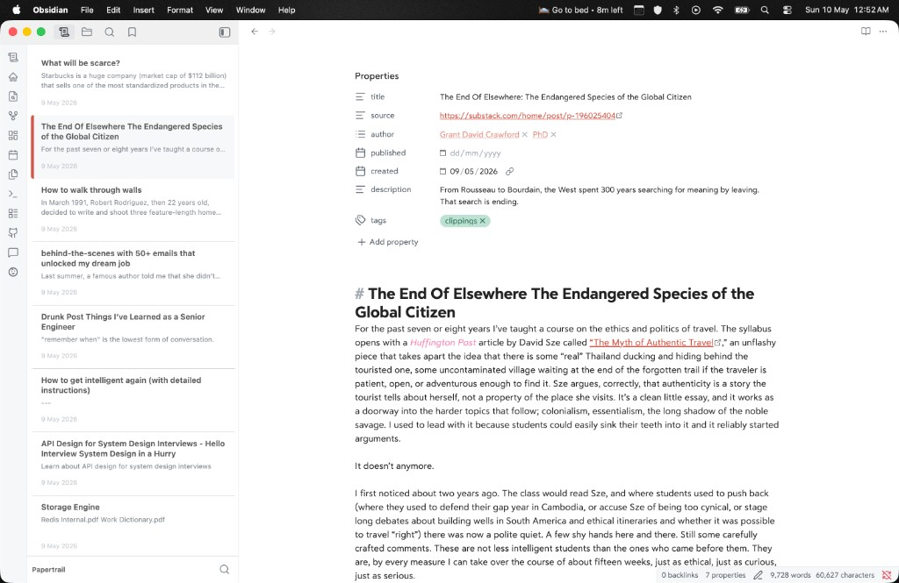

# Papertrail

**Browse every markdown note from the sidebar** — compact cards with title, excerpt, and modified date; a footer with search and quick-create; and a **right‑click menu** aligned with the File Explorer.

Requires **Obsidian 1.5.0+**.  
Repository: [github.com/ankitchouhan1020/papertrail](https://github.com/ankitchouhan1020/papertrail)

---

  

  <em>Sidebar list beside the editor — pick a note, open it, keep context.</em>

---

## Install

| Channel | How |
|--------|-----|
| **Community plugins** | Settings → Community plugins → Browse → **Papertrail** |
| **Manual** | From [Releases](https://github.com/ankitchouhan1020/papertrail/releases), put `main.js`, `manifest.json`, and `styles.css` in `<Vault>/.obsidian/plugins/papertrail/`, then enable the plugin |
| **BRAT** | Add `ankitchouhan1020/papertrail` |

## Usage

- **Ribbon / command “Open Papertrail”** — open or focus the view.
- **Footer** — filter the list; **+** creates a note in the vault’s default location.
- **Right‑click a row** — open in new tab, rename, delete, reveal in navigation when available, plus other **file menu** entries from Obsidian and plugins.

## Settings

| Setting | Description |
|--------|-------------|
| **Sort order** | By modified date, title, or path. |
| **Hide excluded paths** | Also hide paths with a `.` segment (in addition to Obsidian excluded files and `.obsidian`). |

## Development

Use Obsidian’s [**Build a plugin**](https://docs.obsidian.md/Plugins/Getting+started/Build+a+plugin) flow with a **dev vault**, not your primary notes.

1. Clone into `<dev-vault>/.obsidian/plugins/papertrail/`.
2. `npm install` (installs Git hooks via `prepare`; pre-commit runs `npm run build`).
3. `npm run dev` — watch `src/main.ts` and rebuild `main.js` on change.
4. Enable Papertrail and reload when files change (or use [Hot-Reload](https://github.com/pjeby/hot-reload)).

Production bundle: `npm run build`. **Edit `src/main.ts` only** — root `main.js` is generated.

## Releasing

See [COMMUNITY_PLUGIN_CHECKLIST.md](COMMUNITY_PLUGIN_CHECKLIST.md). Bump versions in `manifest.json` / `versions.json`, tag a GitHub release with `main.js`, `manifest.json`, and `styles.css`.

## License

MIT — see [LICENSE](LICENSE).
